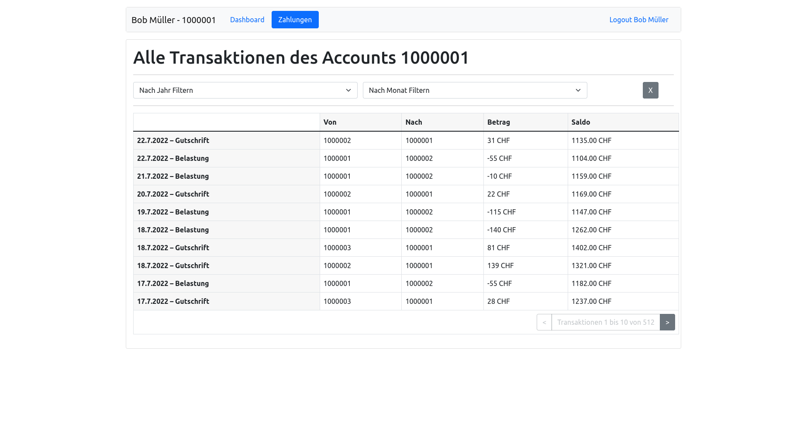

# Testat - Einführung

Für das Testat im Teil React steht ein Assignment auf GitHub Classroom bereit. Die Ausgangslage ist dabei die Solution des vorhergehenden Schritts.

Für das Testat sollen Sie folgende zwei Aufgaben lösen:

## Gebrauch vom Redux Store

Im Moment werden verschiedne Objekte und Werte als Props von der App an die Unterkomponenten mitgegeben. Schreibe für diese Props passende **_Reducers, Actions und Slices_**. Entferne die Props und verbinde die Komponenten (Home, Dashboard, etc.) direkt mit dem Redux-Store.

Anbei eine Liste der Props, welche mindestens in den Redux State verlegt werden müssen:

- User
- Token
- isAuthenticated
- Transactions

Achte auf eine logische Strukturierung der Objekte in einem jeweiligen Slice.

## Transactions

Erweitere die `Transaction`-Komponente nach untenstehendem Abbild.

Du kannst dafür die React-Elemente der Transaktionen aus dem Dashboard als Grundlage nehmen.
Ob Du den Filterstate auch in Redux ablegen, ist Dir überlassen. Du musst die Transaktionen nicht mit den Transaktionen auf dem Dashboard zusammenlegen, das wäre zwar schön, aber für das Testat nicht zwingend.

## Refactoring und Cleanup

Räume den Code am Ende aber auf jeden Fall noch auf! Vereinfache wo möglich Komponenten und entferne nicht mehr verwendeten Code.

## Abgabe

**Die Abgabe muss bis am 19.10.2022 um Mitternacht committed und auf GitHub gepusht werden.**
