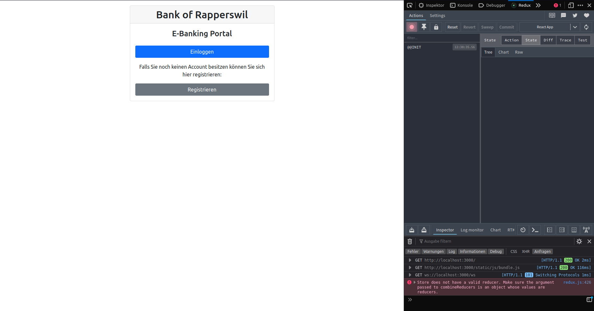

# React Redux

Nun kennst du die Grundlagen von Redux und es ist an der Zeit diese in unsere BOR Applikation zu integrieren.

React stellt spezifische Packages zur Entwicklung mit Redux zur Verfügung.

## Installation

`npm install react-redux`

Dieses Package enthält die offiziellen React Binidngs für Redux.

`npm install @reduxjs/toolkit`

Das Redux Tool Kit haben wir im vorherigen Abschnitt bereits vorgestellt. Es vereinfacht die Entwicklung mit Redux.

## Redux Store Setup






Dieses Objekt beinhaltet den **Store** der BOR Applikation. Ein weiterer Vorteil des Redux Toolkits ist, dass durch diese Konfiguration die DevTools Extensions automatisch miteinbezogen werden und die Webentwicklung dadurch trivialer wird. Stelle sicher, dass du die Redux Devtool Browser Extension in deinem Browser installiert hast.

Als zweiter Schritt soll der **Store** in der React Applikation als Provider eigebunden werden:




Der Redux Store enthält State einer Applikation.
Dieser State wird global gehalten und sollte daher im `index.js` eigebunden werden.

Die Einbindung wird durch die `Provider` Schnittstelle des `react-redux` Packages ermöglicht und umschliesst die `<App>` Komponente.









{% assign s-solution = "
`store.js`

```jsx
import { configureStore } from '@reduxjs/toolkit';

const store = configureStore({
  reducer: {},
});

export default store;
```

`index.js`

```jsx
...
import { Provider } from 'react-redux';
import store from './store';

const root = ReactDOM.createRoot(document.getElementById('root'));
root.render(
  <React.StrictMode>
    <Provider store={store}>
      <BrowserRouter>
        <App />
      </BrowserRouter>
    </Provider>
  </React.StrictMode>
);
```

Öffne die Applikation im Browser. Der Store sollte nun in den Redux Dev Tools initialisiert sein.  
Unter Firefox sieht das so aus:

 <p align='center'>

</p>

Achte darauf, dass noch keine Reducer definiert sind und es deshalb zu Fehlermeldungen in der Konsole kommt.

" %}


## Redux State Slice

Der **Store** ist nun erfolgreich initialisiert. Der nächste Schritt ist das Erstellen eines **States** und die dazugehörigen _puren_ **_Reducer_**-Funktionen, um den State zu verändern.

Um diese Funktionalität aufzuzeigen, wird ein State Slice für den angemeldeten Benutzer erstellt.


{% assign t3-question = "
`./redux/loginSlice.js`

```jsx
import { createSlice } from '@reduxjs/toolkit';

export const loginSlice = createSlice({
  name: 'login',
  initialState: {
    user: {},
    token: '',
  },
  reducers: {
    addUserToState: (state, action) => {
      state.user = action.payload.user;
      state.token = action.payload.token;
    },
    removeUserFromState: (state) => {
      state = { user: {}, token: '' };
    },
  },
});

export const { addUserToState, removeUserFromState } = loginSlice.actions;
export const loginReducer = loginSlice.reducer;
```

Der `loginReducer` muss nun der **Store** Konfiguration hinzugefügt werden:

`store.js`

```jsx
import { configureStore } from '@reduxjs/toolkit';
import { loginReducer } from './redux/loginSlice';

const store = configureStore({
  reducer: { login: loginReducer },
});

export default store;
```

Diese Änderungen haben nun den **Store** mit einem _LoginSlice_ erweitert. Überprüfe in deinem Redux Browser Dev Tool, dass ein initiales `login`-Objekt vorhanden ist.

" %}



Der **Store** wurde erfolgreich mit einem initialen `login` Objekt erweitert. Der nächste Schritt ist das Einbinden der `react-redux`-Hooks `useSelector` und `useDispatch`, woauch immer diese Values gebraucht werden.







{% assign s-solution = "

```jsx
const App = () => {
  const [isAuthenticated, setIsAuthenticated] = useState(false);
  //const [user, setUser] = useState(JSON.parse(sessionStorage.getItem('user')));
  //const [token, setToken] = useState(sessionStorage.getItem('token'));
  const [pathName, setPathName] = useState(null);
  let location = useLocation();

  const dispatch = useDispatch();

  const user = useSelector((state) => state.login.user);
  const token = useSelector((state) => state.login.token);

  const authenticate = (login, password, callback) => {
    api
      .login(login, password)
      .then(({ token, owner }) => {
        setIsAuthenticated(true);
        //setToken(token);
        //setUser(owner);

        dispatch(addUserToState({ user: owner, token }));

        sessionStorage.setItem('token', token);
        sessionStorage.setItem('user', JSON.stringify(owner));
      })
      .catch((error) => callback(error));
  };

  const signout = () => {
    setIsAuthenticated(false);
    //setToken(undefined);
    //setUser(undefined);

    dispatch(removeUserFromState());

    sessionStorage.removeItem('token');
    sessionStorage.removeItem('user');
  };
  ...
}
```

" %}


Nun bist Du besetens gerüstet, um dich ans Testat zu machen;)
