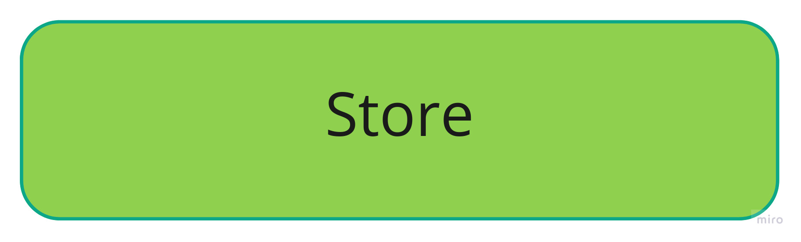
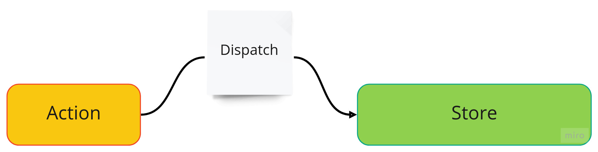
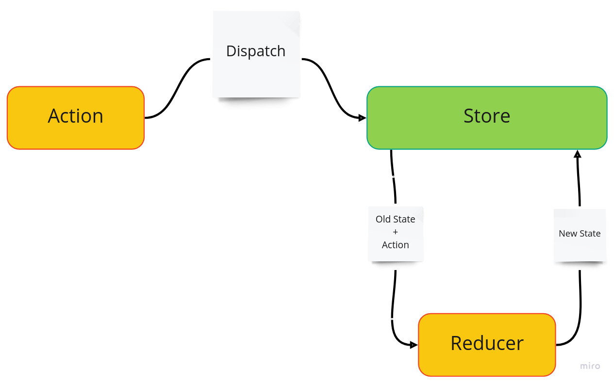

# Redux - Einführung

Redux ermöglicht das einfache Handling des **globalen States** einer Anwendung an einer zentrierten Stelle, dem Redux **_Store_**.

<p align="center">

</p>

Um den **State** zu ändern, werden sogenannte **_Actions_ _dispatched_**.

- **_Actions_** beschreiben dabei, was geändert werden soll
- **_Dispatch_** kümmert sich um die Übermittlung an den **Store**

 <p align="center">

</p>

Eine spezifische **_Aktion_** ändert im **_Store_** durch eine pure **_Reducer_**-Funktion den betroffenen _State_.

- **_Reducer_** enthält die gewünschte Änderungslogik des von einer **_Aktion_** betroffenen _States_.

 <p align="center">

</p>

## Redux Beispiel

Hier ist simples Beispiel von der [Redux Webseite](https://redux.js.org/introduction/getting-started).

```jsx
import { createStore } from "redux";

/**
 * This is a reducer - a function that takes a current state value and an
 * action object describing "what happened", and returns a new state value.
 * A reducer's function signature is: (state, action) => newState
 *
 * The Redux state should contain only plain JS objects, arrays, and primitives.
 * The root state value is usually an object. It's important that you should
 * not mutate the state object, but return a new object if the state changes.
 *
 * You can use any conditional logic you want in a reducer. In this example,
 * we use a switch statement, but it's not required.
 */
function counterReducer(state = { value: 0 }, action) {
  switch (action.type) {
    case "counter/incremented":
      return { value: state.value + 1 };
    case "counter/decremented":
      return { value: state.value - 1 };
    default:
      return state;
  }
}

// Create a Redux store holding the state of your app.
// Its API is { subscribe, dispatch, getState }.
let store = createStore(counterReducer);

// You can use subscribe() to update the UI in response to state changes.
// Normally you'd use a view binding library (e.g. React Redux) rather than subscribe() directly.
// There may be additional use cases where it's helpful to subscribe as well.

store.subscribe(() => console.log(store.getState()));

// The only way to mutate the internal state is to dispatch an action.
// The actions can be serialized, logged or stored and later replayed.
store.dispatch({ type: "counter/incremented" });
// {value: 1}
store.dispatch({ type: "counter/incremented" });
// {value: 2}
store.dispatch({ type: "counter/decremented" });
// {value: 1}
```

_Instead of mutating the state directly, you specify the mutations you want to happen with plain objects called actions. Then you write a special function called a reducer to decide how every action transforms the entire application's state._

_In a typical Redux app, there is just a single store with a single root reducing function. As your app grows, you split the root reducer into smaller reducers independently operating on the different parts of the state tree. This is exactly like how there is just one root component in a React app, but it is composed out of many small components._

_This architecture might seem like a lot for a counter app, but the beauty of this pattern is how well it scales to large and complex apps. It also enables very powerful developer tools, because it is possible to trace every mutation to the action that caused it. You can record user sessions and reproduce them just by replaying every action._

## Redux Toolkit
Das Redux Toolkit erleichtert die Benutzung von Redux.  
Eine Slice Taktik wird eingeführt, welche es vereinfachtert, verschiednene States, Actions und Reducers zu bündeln und auszulagern. 

Das obige Beispiel sieht durch die Verwendung von Redux Toolkit wiefolgt aus: 

``` jsx
import { createSlice, configureStore } from '@reduxjs/toolkit'

const counterSlice = createSlice({
  name: 'counter',
  initialState: {
    value: 0
  },
  reducers: {
    incremented: state => {
      // Redux Toolkit allows us to write "mutating" logic in reducers. It
      // doesn't actually mutate the state because it uses the Immer library,
      // which detects changes to a "draft state" and produces a brand new
      // immutable state based off those changes
      state.value += 1
    },
    decremented: state => {
      state.value -= 1
    }
  }
})

export const { incremented, decremented } = counterSlice.actions

const store = configureStore({
  reducer: counterSlice.reducer
})

// Can still subscribe to the store
store.subscribe(() => console.log(store.getState()))

// Still pass action objects to `dispatch`, but they're created for us
store.dispatch(incremented())
// {value: 1}
store.dispatch(incremented())
// {value: 2}
store.dispatch(decremented())
// {value: 1}
```
